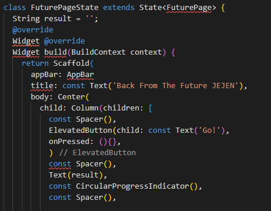
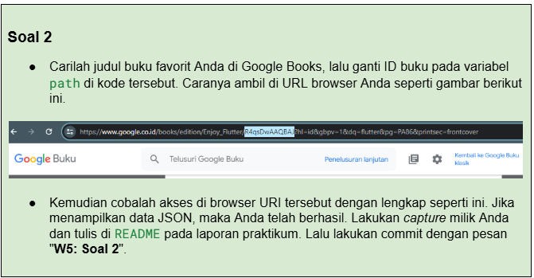
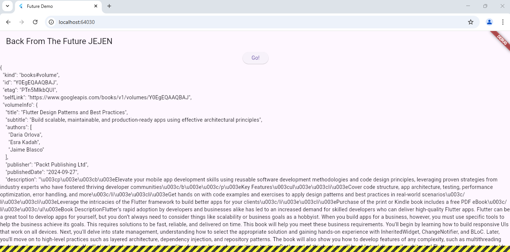
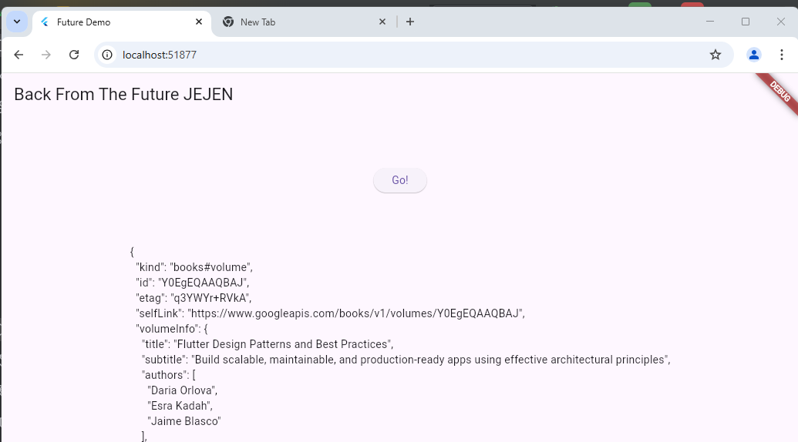

# books

A new Flutter project.

Praktikum 1: Mengunduh Data dari Web Service (API)
Selesaikan langkah-langkah praktikum berikut ini menggunakan editor Visual Studio Code (VS Code) atau Android Studio atau code editor lain kesukaan Anda. Jawablah di laporan praktikum Anda pada setiap soal yang ada di beberapa langkah praktikum ini.

## Getting Started

## *Soal 1*
Tambahkan nama panggilan Anda pada title app sebagai identitas hasil pekerjaan Anda.
## *jawaban soal 1*

## *Jawaban soal 2*

## *Soal 3*
Jelaskan maksud kode langkah 5 tersebut terkait substring dan catchError!
Capture hasil praktikum Anda berupa GIF dan lampirkan di README. Lalu lakukan commit dengan pesan "W5: Soal 3".

