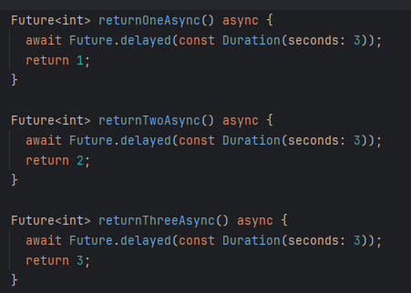
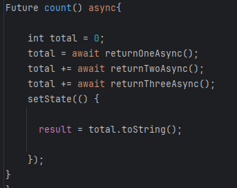
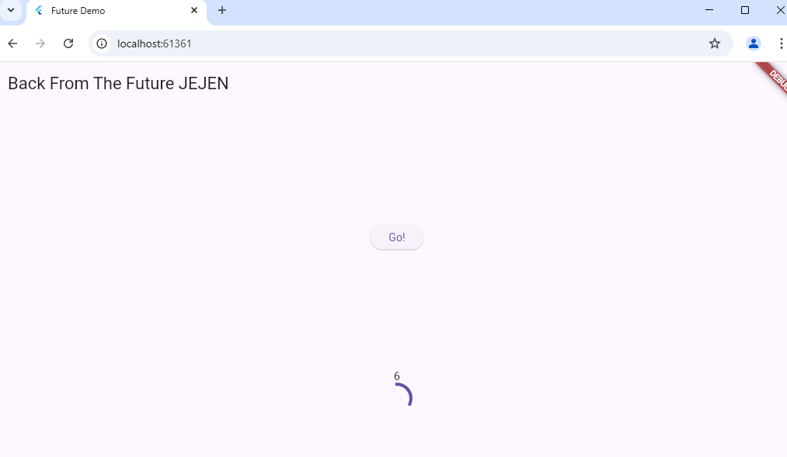

# books

A new Flutter project.

Praktikum 1: Mengunduh Data dari Web Service (API)

## Getting Started

## *Soal 1*
Tambahkan nama panggilan Anda pada title app sebagai identitas hasil pekerjaan Anda.
## *jawaban soal 1*

## *Jawaban soal 2*

## *Soal 3*
Jelaskan maksud kode langkah 5 tersebut terkait substring dan catchError!
Capture hasil praktikum Anda berupa GIF dan lampirkan di README. Lalu lakukan commit dengan pesan "W5: Soal 3".

Jawaban soal3
substring adalah metode dalam Dart yang digunakan untuk mengambil sebagian dari string berdasarkan indeks yang kita tentukan. Fungsi ini memotong bagian string sesuai dengan parameter yang diberikan.

catchError adalah metode yang digunakan untuk menangani error atau pengecualian dalam alur eksekusi asinkron di Dart, khususnya dalam operasi yang melibatkan Future. Jika ada kesalahan saat menjalankan kode dalam Future, kita dapat menangani error tersebut dengan catchError.

## **Praktikum 2: Menggunakan await/async untuk menghindari callbacks**

## *Soal 4*
*Jelaskan maksud kode langkah 1 dan 2 tersebut!*

*langkah 1*

1. returnOneAsync()

    - Fungsi ini mengembalikan Future<int>. Artinya, fungsi ini mengembalikan nilai integer di masa depan 
      (setelah proses asynchronous selesai).

    - await Future.delayed(const Duration(seconds: 3)) digunakan untuk menunda eksekusi selama 3 detik 
      (simulasi delay, bisa digunakan untuk menunggu data dari API, operasi I/O, dll.).

    - Setelah 3 detik, fungsi ini akan mengembalikan nilai 1.

2. returnTwoAsync()

      Fungsi ini mirip dengan returnOneAsync(), hanya saja setelah menunggu selama 3 detik, ia akan mengembalikan nilai 2.

  3. returnThreeAsync()

     Fungsi ini juga memiliki struktur yang sama dengan dua fungsi sebelumnya, tetapi ia mengembalikan nilai 3 setelah menunggu selama 3 detik.

*langkah 2*

*Penjelasan:*

1. Deklarasi Fungsi Asynchronous (Future count() async)

   - Future count() async: Fungsi ini dideklarasikan sebagai asynchronous dengan kata kunci async, yang berarti 
     fungsi ini akan mengembalikan Future dan memungkinkan penggunaan await di dalamnya.

   - Fungsi ini tidak mengembalikan nilai (void), tetapi mengembalikan Future yang menunjukkan bahwa fungsi ini 
  bersifat asynchronous.

2. Deklarasi dan Inisialisasi Variabel total

   - total adalah variabel bertipe integer yang digunakan untuk menyimpan hasil penjumlahan dari tiga nilai 
     yang diambil dari fungsi asynchronous.

   - total diinisialisasi dengan nilai awal 0.

3. Menunggu dan Mendapatkan Nilai dari returnOneAsync()

   - await returnOneAsync() akan menjalankan fungsi returnOneAsync() yang mengembalikan nilai 1 setelah 
     menunggu 3 detik.

   - Karena await digunakan, eksekusi kode akan menunggu sampai fungsi returnOneAsync() selesai dan 
     mengembalikan nilai, kemudian hasilnya (1) disimpan di dalam variabel total.

4. Menambah Nilai dari returnTwoAsync() ke total

   - await returnTwoAsync() akan menunggu hasil dari fungsi returnTwoAsync(), yang mengembalikan nilai 2 
     setelah menunggu 3 detik.

   - Setelah itu, nilai total akan ditambah dengan 2. Sehingga, jika sebelumnya total bernilai 1, setelah   
     operasi ini, total akan menjadi 3 (1 + 2).

5. Menambah Nilai dari returnThreeAsync() ke total

   - await returnThreeAsync() akan menunggu hasil dari fungsi returnThreeAsync(), yang mengembalikan nilai 3 
     setelah menunggu 3 detik.

   - Setelah itu, nilai total akan ditambah dengan 3. Jika sebelumnya total bernilai 3, maka setelah operasi 
     ini, total akan menjadi 6 (3 + 3).

6. Memperbarui UI dengan setState

   - setState() digunakan untuk memberitahu framework Flutter bahwa status dari widget telah berubah dan UI 
     perlu diperbarui.

   - Di dalam setState(), nilai total diubah menjadi string (total.toString()) dan disimpan dalam variabel 
     result.

   - Kemudian, nilai result ini akan digunakan untuk memperbarui tampilan UI (misalnya di Text(result) atau 
     widget lain yang menampilkan hasil).

*Capture hasil praktikum Anda berupa GIF dan lampirkan di README. Lalu lakukan commit dengan pesan "W5: Soal 4"*

