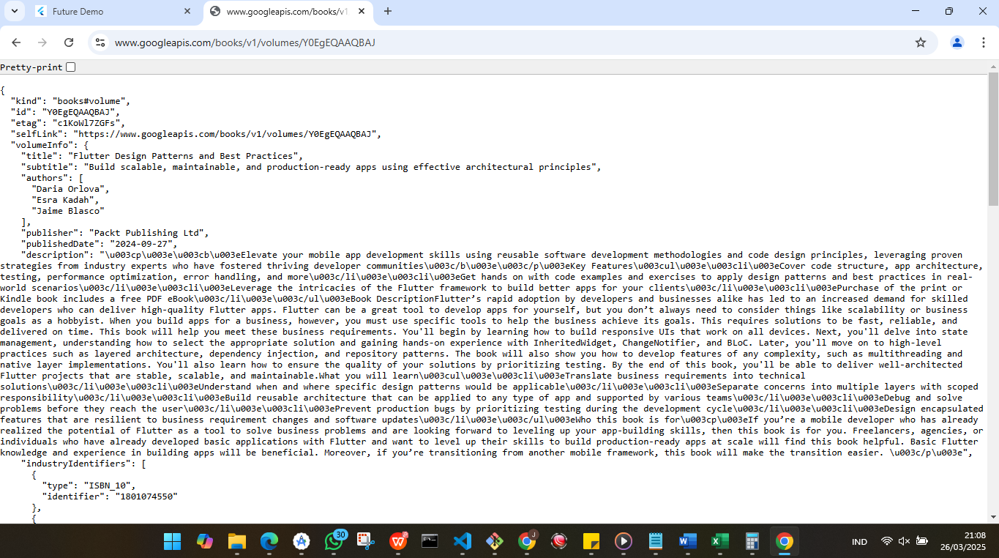
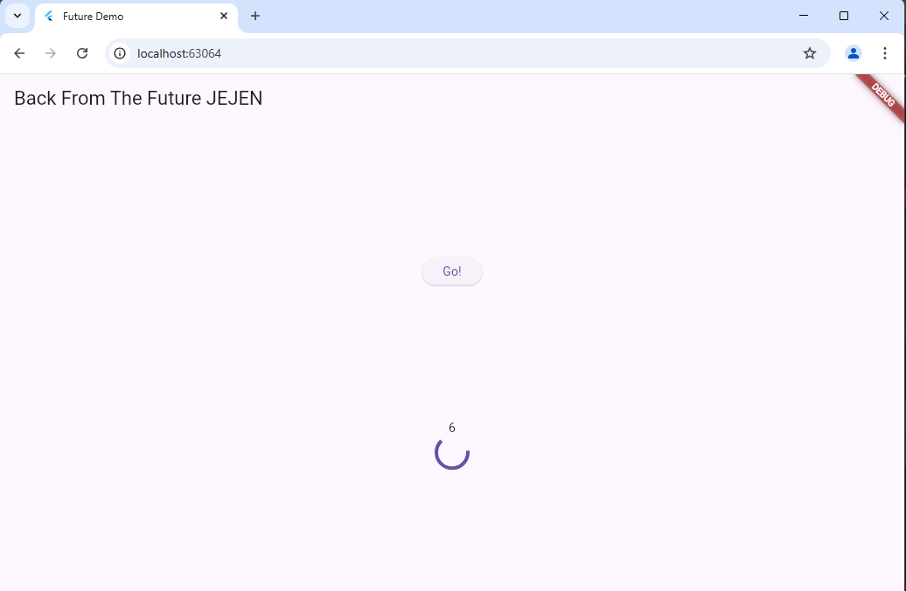

# books

A new Flutter project.

Praktikum 1: Mengunduh Data dari Web Service (API)

## Getting Started

## *Soal 1*
Tambahkan nama panggilan Anda pada title app sebagai identitas hasil pekerjaan Anda.
## *jawaban soal 1*

## *Jawaban soal 2*

## *Soal 3*
Jelaskan maksud kode langkah 5 tersebut terkait substring dan catchError!
Capture hasil praktikum Anda berupa GIF dan lampirkan di README. Lalu lakukan commit dengan pesan "W5: Soal 3".

Jawaban soal3
substring adalah metode dalam Dart yang digunakan untuk mengambil sebagian dari string berdasarkan indeks yang kita tentukan. Fungsi ini memotong bagian string sesuai dengan parameter yang diberikan.

catchError adalah metode yang digunakan untuk menangani error atau pengecualian dalam alur eksekusi asinkron di Dart, khususnya dalam operasi yang melibatkan Future. Jika ada kesalahan saat menjalankan kode dalam Future, kita dapat menangani error tersebut dengan catchError.

## **Praktikum 2: Menggunakan await/async untuk menghindari callbacks**

## *Soal 4*
*Jelaskan maksud kode langkah 1 dan 2 tersebut!*

*langkah 1*

1. returnOneAsync()

    - Fungsi ini mengembalikan Future<int>. Artinya, fungsi ini mengembalikan nilai integer di masa depan 
      (setelah proses asynchronous selesai).

    - await Future.delayed(const Duration(seconds: 3)) digunakan untuk menunda eksekusi selama 3 detik 
      (simulasi delay, bisa digunakan untuk menunggu data dari API, operasi I/O, dll.).

    - Setelah 3 detik, fungsi ini akan mengembalikan nilai 1.

2. returnTwoAsync()

      Fungsi ini mirip dengan returnOneAsync(), hanya saja setelah menunggu selama 3 detik, ia akan mengembalikan nilai 2.

  3. returnThreeAsync()

     Fungsi ini juga memiliki struktur yang sama dengan dua fungsi sebelumnya, tetapi ia mengembalikan nilai 3 setelah menunggu selama 3 detik.

*langkah 2*

*Penjelasan:*

1. Deklarasi Fungsi Asynchronous (Future count() async)

   - Future count() async: Fungsi ini dideklarasikan sebagai asynchronous dengan kata kunci async, yang berarti 
     fungsi ini akan mengembalikan Future dan memungkinkan penggunaan await di dalamnya.

   - Fungsi ini tidak mengembalikan nilai (void), tetapi mengembalikan Future yang menunjukkan bahwa fungsi ini 
  bersifat asynchronous.

2. Deklarasi dan Inisialisasi Variabel total

   - total adalah variabel bertipe integer yang digunakan untuk menyimpan hasil penjumlahan dari tiga nilai 
     yang diambil dari fungsi asynchronous.

   - total diinisialisasi dengan nilai awal 0.

3. Menunggu dan Mendapatkan Nilai dari returnOneAsync()

   - await returnOneAsync() akan menjalankan fungsi returnOneAsync() yang mengembalikan nilai 1 setelah 
     menunggu 3 detik.

   - Karena await digunakan, eksekusi kode akan menunggu sampai fungsi returnOneAsync() selesai dan 
     mengembalikan nilai, kemudian hasilnya (1) disimpan di dalam variabel total.

4. Menambah Nilai dari returnTwoAsync() ke total

   - await returnTwoAsync() akan menunggu hasil dari fungsi returnTwoAsync(), yang mengembalikan nilai 2 
     setelah menunggu 3 detik.

   - Setelah itu, nilai total akan ditambah dengan 2. Sehingga, jika sebelumnya total bernilai 1, setelah   
     operasi ini, total akan menjadi 3 (1 + 2).

5. Menambah Nilai dari returnThreeAsync() ke total

   - await returnThreeAsync() akan menunggu hasil dari fungsi returnThreeAsync(), yang mengembalikan nilai 3 
     setelah menunggu 3 detik.

   - Setelah itu, nilai total akan ditambah dengan 3. Jika sebelumnya total bernilai 3, maka setelah operasi 
     ini, total akan menjadi 6 (3 + 3).

6. Memperbarui UI dengan setState

   - setState() digunakan untuk memberitahu framework Flutter bahwa status dari widget telah berubah dan UI 
     perlu diperbarui.

   - Di dalam setState(), nilai total diubah menjadi string (total.toString()) dan disimpan dalam variabel 
     result.

   - Kemudian, nilai result ini akan digunakan untuk memperbarui tampilan UI (misalnya di Text(result) atau 
     widget lain yang menampilkan hasil).

*Capture hasil praktikum Anda berupa GIF dan lampirkan di README. Lalu lakukan commit dengan pesan "W5: Soal 4"*

## Praktikum 3: Menggunakan Completer di Future

Soal 5
Jelaskan maksud kode langkah 2 tersebut!

1. late Completer completer;

    - Completer adalah sebuah objek yang digunakan untuk mengontrol Future secara manual. Dengan Completer, 
      kita bisa mengubah status Future menjadi selesai (complete) pada saat yang kita tentukan.

    - late digunakan di sini untuk menunjukkan bahwa completer akan diinisialisasi nanti. late menandakan bahwa 
      variabel tersebut akan diberi nilai pada titik tertentu sebelum digunakan. Tanpa late, kamu harus menginisialisasi variabel pada deklarasi.

    - Tipe generik Completer<int> berarti bahwa completer akan mengelola Future<int> yang akan selesai dengan 
      sebuah nilai bertipe int.

2.  Future getNumber()

    - Fungsi getNumber() mengembalikan Future yang akan berakhir dengan nilai integer (Future<int>).
        - completer = Completer<int>(); — Membuat sebuah objek Completer<int>. Ini berarti kita siap untuk    
          mengelola sebuah Future<int>.
          
        - calculate(); — Memanggil fungsi calculate(), yang merupakan operasi asinkron yang akan menunda 
          eksekusi selama 5 detik dan kemudian menyelesaikan Completer dengan nilai 42.

        - return completer.future; — Mengembalikan future yang dihasilkan oleh completer. Future ini akan 
          berisi hasil yang diberikan oleh completer.complete(42) setelah 5 detik.

3. Future calculate()

    - Fungsi calculate() adalah operasi asinkron yang menunda eksekusi selama 5 detik menggunakan 
      Future.delayed().

    - completer.complete(42); — Setelah 5 detik, kita menyelesaikan completer dengan nilai 42. Ini mengubah 
      status Future yang dikendalikan oleh completer menjadi selesai (completed) dan memberikan hasilnya sebagai 42.

    Sistem kerja kode tersebut ialah

    1. Ketika fungsi getNumber() dipanggil, kita membuat sebuah objek Completer<int>.
    2. Fungsi calculate() dipanggil untuk menunda eksekusi selama 5 detik.
    3. Setelah 5 detik, completer.complete(42) dipanggil untuk memberikan nilai 42 pada Future yang 
       dikendalikan oleh completer.
    4. getNumber() mengembalikan future yang terkait dengan completer. Pada titik ini, future masih belum 
       selesai dan menunggu sampai completer.complete() dipanggil setelah 5 detik.
    5. Ketika completer.complete(42) dipanggil, future menjadi selesai dan berisi nilai 42.

Dengan menggunakan Completer, kita mendapatkan kontrol penuh atas kapan Future dianggap selesai dan memberikan hasilnya. Ini berguna dalam kasus-kasus di mana kamu membutuhkan lebih banyak kontrol atas operasi asinkron, misalnya ketika mengintegrasikan logika eksternal atau perhitungan yang memakan waktu.

Capture hasil praktikum Anda berupa GIF dan lampirkan di README. Lalu lakukan commit dengan pesan "W5: Soal 5".

**Soal 6**

**Jelaskan maksud perbedaan kode langkah 2 dengan langkah 5-6 tersebut!**

**Perbedaan kode pada langkah ke-2**

ialah kode yang menggunakan Menggunakan Completer Tanpa completeError()

Kelebihan menggunakan kode ini yaitu Sederhana: Kode ini cukup sederhana dan langsung ke titik dengan hanya menyelesaikan Future tanpa perlu menangani error secara eksplisit.

Dibalik kelebihan kode tersebut tentu ada kekurangannya 
kodeini tidak ada penanganan error: Jika terjadi error di dalam calculate(), kita tidak menangani error tersebut dengan cara yang terstruktur. Hal ini bisa menyebabkan Future tidak dapat diselesaikan dengan benar jika ada masalah dalam operasi asinkron. Penanganan error harus ditangani oleh pengguna kode saat memanggil getNumber(), yang lebih terbatas.

**perbedaan kode langkah ke 5**

Perbedaan kode pada langkah ke-5 ialah kode yang menggunakan Completer Tanpa completeError()

Kelebihan menggunakan kode ini yaitu kode sederhana dan langsung ke titik dengan hanya menyelesaikan Future tanpa perlu menangani error secara eksplisit.

kekurangannya ialah Tidak ada penanganan error: Jika terjadi error di dalam calculate(), kita tidak menangani error tersebut dengan cara yang terstruktur. Hal ini bisa menyebabkan Future tidak dapat diselesaikan dengan benar jika ada masalah dalam operasi asinkron. Penanganan error harus ditangani oleh pengguna kode saat memanggil getNumber(), yang lebih terbatas.

**perbedaan kode langkah ke 6**

Pada langkah ke-6 ini kode yang menggunakan then() dan catchError()

kelabihan kode ini sangat umum dan mudah digunakan. then() dan catchError() adalah cara konvensional untuk menangani Future di Dart.
namun ada kekurangan jika menggunakan kode ini ketika Penanganan error dilakukan di luar fungsi asinkron itu sendiri, dan error tersebut hanya bisa ditangani pada saat Future selesai.

Capture hasil praktikum Anda berupa GIF dan lampirkan di README. Lalu lakukan commit dengan pesan "W5: Soal 6".

## **Praktikum 4: Memanggil Future secara paralel**

**Soal 7**

Capture hasil praktikum Anda berupa GIF dan lampirkan di README. Lalu lakukan commit dengan pesan "W5: Soal 7".

**Soal 8**
Jelaskan maksud perbedaan kode langkah 1 dan 4!

Perbedaan kode pada langkah ke-1 ialah kode tersebut menggunakan FuterGroup<int> dimna futergroup tersebut adalah bagian dari package async yang digunakan untuk mengelola beberapa Future secara paralel.
  
  **Kelebihan:**

- FutureGroup memungkinkan penambahan Future secara dinamis jika jumlahnya tidak tetap dan jika ingin mengelola 
  beberapa Future secara lebih fleksibel.

- Pada penggunaan kode tersebut juga bisa menambahkan lebih banyak Future ke dalam grup bahkan setelah memulai  
  eksekusi, membuatnya lebih dinamis dalam pengelolaannya.

**Kekurangan:**

- Memerlukan penggunaan package async dari pihak ketiga.

- Kode cenderung lebih panjang dan membutuhkan langkah tambahan seperti menutup grup dengan close().

Perbedaan kode pada langkah ke-4 ialah kode tersebut menggunakan Future.wait(): dimana Future.wait() adalah metode built-in dalam Dart yang digunakan untuk menjalankan beberapa Future secara paralel dan menunggu semua Future tersebut selesai.

**Kelebihan**

    - Lebih sederhana dan mudah dibaca karena menggunakan metode Dart standar.

    - Tidak memerlukan library tambahan selain yang sudah tersedia di Dart SDK.

    - Memungkinkan pengelolaan beberapa Future dalam satu baris kode tanpa perlu menambahkan close() atau 
      proses lain.

**Kekurangan**

    - Tidak fleksibel dalam hal menambah Future secara dinamis setelah eksekusi dimulai. Semua Future harus 
      ditentukan sebelumnya dalam list.

    - Jika ada Future yang gagal, semuanya akan gagal. Tidak ada penanganan error per Future, kecuali kita 
      menggunakan catchError atau try-catch.

